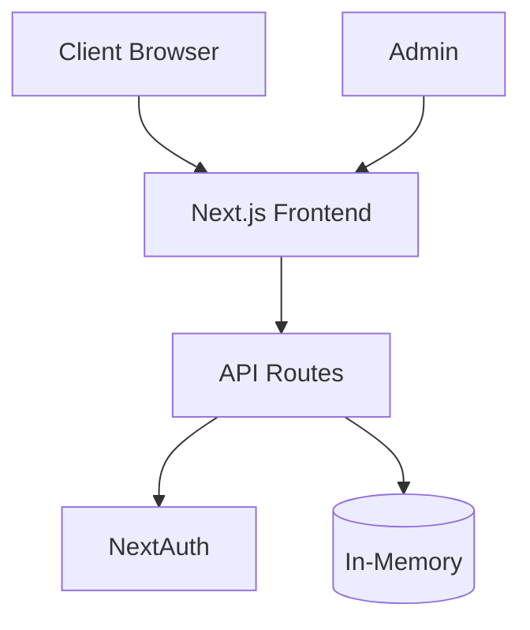

# Alma Immigration Lead Management - System Design
**Deployed App**: [https://alma-leads.vercel.app](https://alma-leads.vercel.app)

## 1. System Architecture


## 2. Tech Stack
- **Frontend**: Next.js 15.3.2, Tailwind CSS, React Hook Form
- **Backend**: Next.js API Routes, NextAuth.js
- **Validation**: Zod
- **Deployment**: Vercel (alma-leads.vercel.app)
- **Development**: Local ports 3000-3002, supports Turbopack

## 3. Core Features
- Public lead form submission
- Admin dashboard with authentication
- Lead status management (Pending/Reached Out)
- Resume file upload support

## 4. Data Model
```typescript
interface Lead {
  id: string;
  firstName: string;
  lastName: string;
  email: string;
  country: string;
  linkedinProfile: string;
  visasOfInterest: string[];
  status: 'PENDING' | 'REACHED_OUT';
  submittedAt: Date;
}
```

## 5. API Endpoints
- `POST /api/leads` - Submit lead
- `GET /api/leads` - List leads (protected)
- `PATCH /api/leads/[id]` - Update status (protected)

## 6. Current Limitations
- In-memory storage (no persistence)
- Single admin account
- No file storage implementation
- No email notifications

## 7. Security
- NextAuth.js authentication
- Environment variables
- Form validation
- Protected admin routes

This design serves as a foundation for a scalable lead management system, with clear paths for enhancement through persistent storage and additional features.
